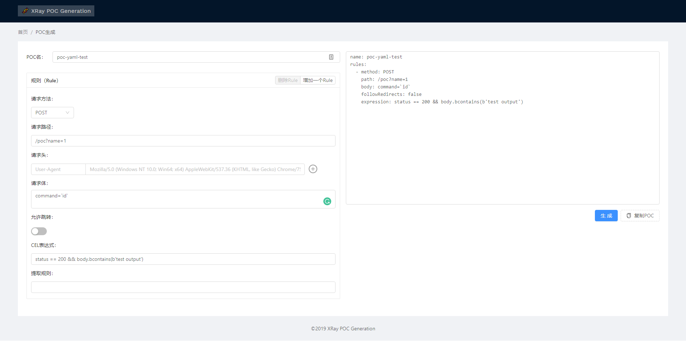

# 🧬 XRay POC Generation

XRay安全评估 > POC辅助生成工具。

关于XRay:

- [XRay 安全评估工具](https://github.com/chaitin/xray)
- [如何编写YAML格式POC](https://chaitin.github.io/xray/#/guide/poc)

访问 <https://phith0n.github.io/xray-poc-generation/> 即可直接使用。



## 💻 本地运行

本地运行XRay POC Generation：

```shell script
git clone https://github.com/phith0n/xray-poc-generation
cd xray-poc-generation
yarn
yarn build
```

编译完成后，Web目录在`build/`文件夹。